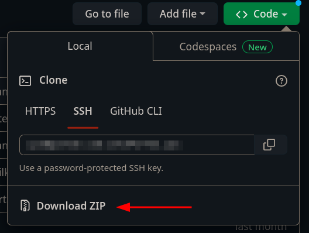
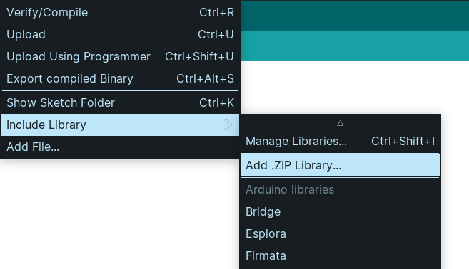

# Biblioteca laboratorioFW-DIY

Nesta biblioteca é possível encontrar o mapeamento entre a pinagem da placa Franzininho Wifi e a codificação dos pinos de ativação da placa [Laboratório DIY - Franzininho Wifi](https://github.com/Franzininho/laboratorio-diy-franizininho-wifi).

## Como instalar a biblioteca

1. Faça o donwload da biblioteca em formato zip clicando em **Code** e depois em **Download ZIP**



2. Abra a IDE do Arduino
3. Vá em Sketch > Include Library > Add .ZIP Library



4. Selecione o arquivo zip baixado e clique em ok
5. Opcional: Procure pelos exemplos da biblioteca em File > Examples

## Como usar a biblioteca

Para utilizar a biblioteca basta incluí-la no seu arquivo de código com a linha `#include<laboratorioFW-DIY.h>`. Depois disso, você pode utilizar os códigos dos pinos de ativação na placa dentro do seu código.

**Importante : Os algorismos do código do pino de ativação são separados por um caractere de `_`, ou seja o pino de ativação L0 pode ser acessado no código através do código L_0 e assim por diante.**

## Exemplo de utilização:

```c
#include <laborarotioFW-DIY.h>

#define led L_1

void setup(){
    pinMode(led,OUTPUT);
}

void loop{
    digitalWrite(led,HIGH);
    delay(1000);
    digitalWrite(led,LOW);
    delay(1000);
}
```

## Informações importantes

- [Mapeamento dos pinos](./mapeamento.md)

---

#### Feito por [LelePG](https://github.com/LelePG)
